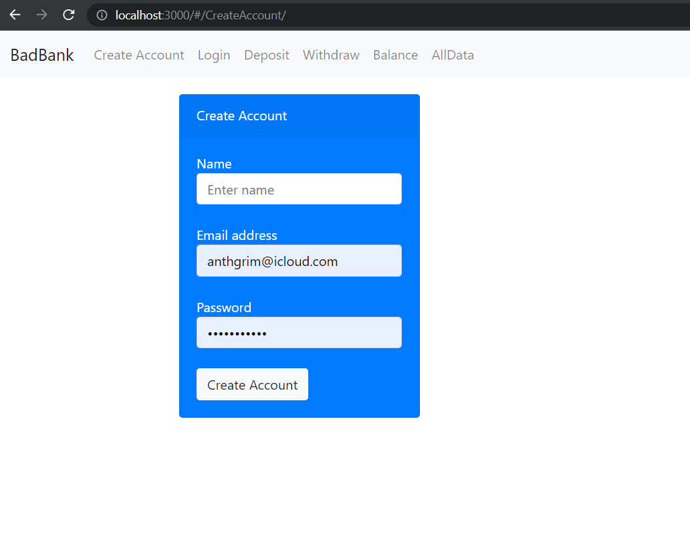

# Bad Bank - MIT

## App Information

### Title: Bad Bank Application

### Description:

Bad Bank is the Capstone Project for Module 2 in the MIT - Fullstack Development with MERN. It is called Bad Bank due to the users data exposured in the UI (intentionally).

It consists of a simple React application where the students apply concepts such as hooks, context, routing, and form validations, connected with a expressJS API using mongoDb as the document oriented database.

### Installation Guidelines

Simply download the zip folder with the source code file, or fork it into your github and clone it into your machine, and run it by using your favorite IDE.

In your terminal run the following:

```shell
git clone git@github.com:anthgrim/badbank-standalone.git
cd badbank-standalone
npm install
node index.js
```





### Technologies and libraries used:

- React JS
- Bootstrap

### Functionalities available:

- Create Account
- Login to Account
- Deposit
- Withdraw

### Future Adds

- Redefine the UI
- Create function to add more accounts to one user

### Author

Kevin Grimaldi.
Student at MIT - Fullstack Development with MERN

### License

MIT License
